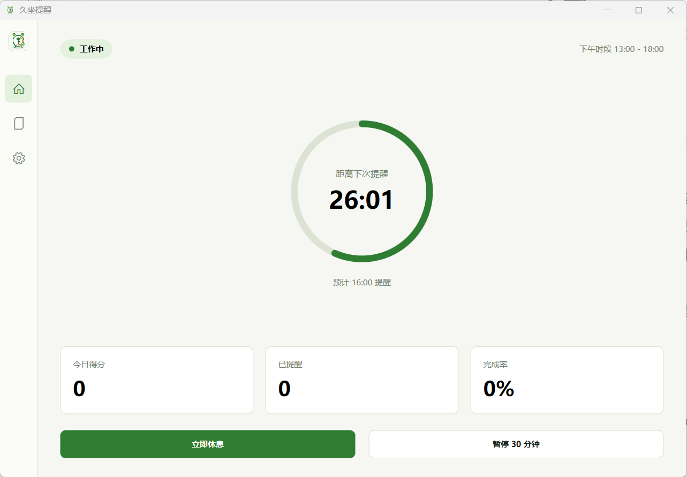
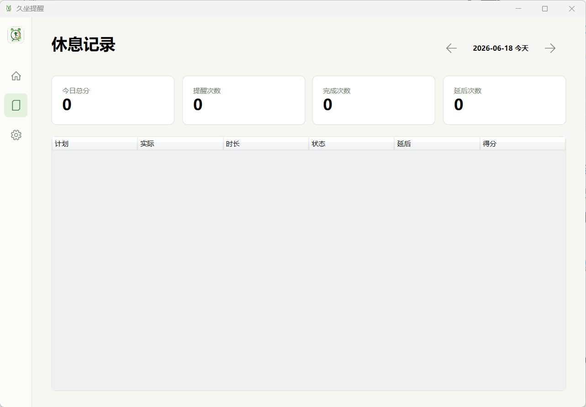
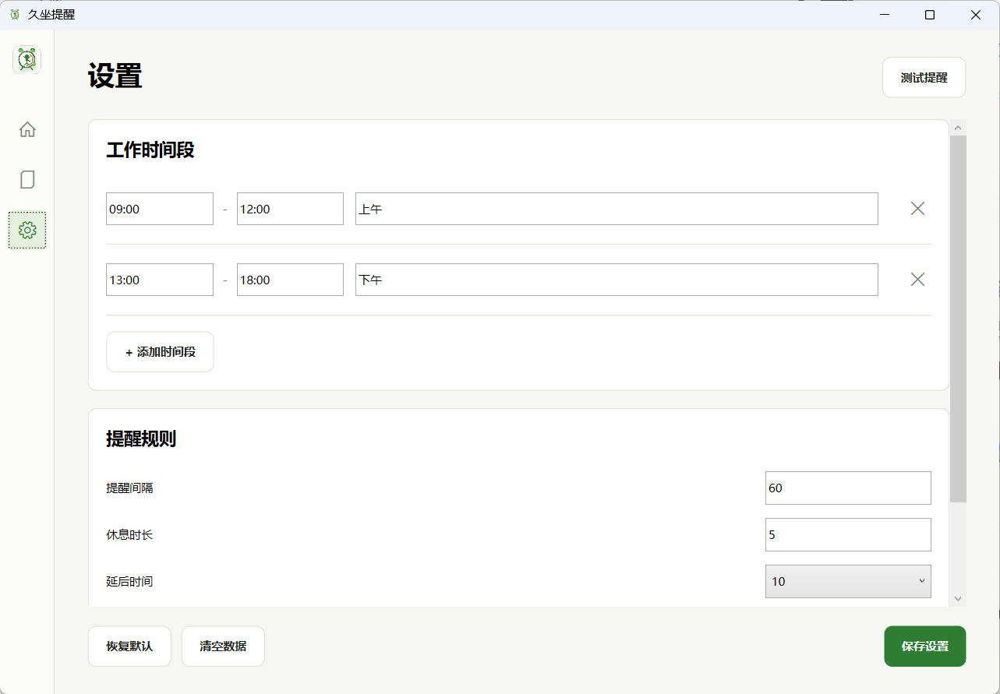

# 久坐提醒

一款 Windows 11 轻量级久坐提醒工具。应用会在工作时间内按设定间隔弹出置顶休息提醒，通过倒计时、延后一次和计分记录帮助养成起身活动的习惯。

## 下载

[点击下载 StandUpReminder.exe](https://github.com/dxlcf/standup-reminder/releases/latest/download/StandUpReminder.exe)

下载后双击即可运行，无需安装 .NET 运行时。

## 功能

- 工作时间段：默认 `09:00-12:00`、`13:00-18:00`，支持多个时间段。
- 定时提醒：默认每 60 分钟提醒一次，默认休息 5 分钟。
- 休息弹窗：置顶显示倒计时，支持延后一次和提前结束确认。
- 本地记录：按天记录最近 30 天休息数据，纯本地 JSON 存储。
- 托盘常驻：支持打开主界面、立即休息、暂停 30 分钟、今日记录和退出。
- 开机自启：默认开启，可在设置里关闭。
- 数据管理：支持恢复默认设置、清空休息记录和运行状态。

## 截图

### 主界面




### 休息记录



### 设置



## 开发环境

- Windows 11
- .NET 8 SDK 或更新版本
- WPF

## 构建

```powershell
dotnet build -c Release
```

## 发布 GitHub Release

本仓库已配置 GitHub Actions。创建并推送 `v*` 版本标签后，会自动构建 Windows x64 单文件 exe，并把 `StandUpReminder.exe` 上传到 GitHub Release。

```powershell
git tag v1.0.0
git push origin v1.0.0
```

发布完成后，下载地址为：

```text
https://github.com/dxlcf/standup-reminder/releases/latest/download/StandUpReminder.exe
```

## 手动发布单文件 exe

```powershell
dotnet publish -c Release -r win-x64 --self-contained `
  -p:PublishSingleFile=true `
  -p:EnableCompressionInSingleFile=true `
  -p:PublishReadyToRun=false `
  -p:IncludeNativeLibrariesForSelfExtract=true
```

手动发布产物位于：

```text
bin/Release/net8.0-windows/win-x64/publish/StandUpReminder.exe
```

说明：WPF 自包含发布在 .NET 8 下不支持 trimming，因此 exe 体积会高于设计文档中的 50MB 目标。

## 数据位置

应用数据存储在当前用户目录：

```text
%APPDATA%/StandUpReminder/
```

包含：

- `settings.json`：用户设置
- `state.json`：运行状态
- `records/*.json`：每日休息记录

## 设计文档

完整产品与技术方案见 [久坐提醒软件设计文档.md](久坐提醒软件设计文档.md)。
